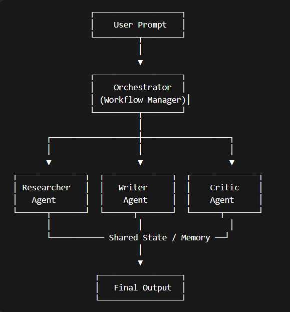

# Multi-Agent AI System

## Overview

This project implements a **multi-agent AI architecture** where specialized agents collaborate to solve a complex task. Instead of relying on a single AI system, multiple agents with distinct roles work together under the control of a central orchestrator.

The system demonstrates how agentic workflows can improve modularity, scalability, and task specialization in AI systems.

## System Architecture

The system consists of four main components:

### 1. Orchestrator
The orchestrator manages the workflow and coordinates the interaction between agents. It ensures that tasks are executed in the correct sequence.

### 2. Researcher Agent
The researcher agent gathers relevant information about the given task and produces research notes.

### 3. Writer Agent
The writer agent uses the research notes to generate a draft of the requested content.

### 4. Critic Agent
The critic agent reviews the draft and improves it to produce the final output.


## Workflow

The system follows a deterministic workflow:

User Prompt → Researcher → Writer → Critic → Final Output

Each agent updates a shared state object that stores the intermediate results.

## Agent Communication and Shared State

The agents communicate through a shared state object that persists across the workflow.  
This shared state acts as a memory where each agent reads previous outputs and writes its own results.

Example state structure:

{
"task": "Write a blog post about multi-agent AI systems",
"research": "Research notes generated by Researcher Agent",
"draft": "Draft generated by Writer Agent",
"final_output": "Improved content generated by Critic Agent"
}

## Project Structure
```bash
multi-agent-ai-system
│
├── agents
│ ├── base_agent.py
│ ├── researcher.py
│ ├── writer.py
│ └── critic.py
│
├── orchestrator
│ └── orchestrator.py
│
├── memory
│ └── shared_state.py
│
├── logs
│ └── logger.py
│
├── example.py
├── requirements.txt
├── README.md
├── evaluation.md
└── architecture.png
```

## Installation

1. Clone the repository
```bash
git clone <repository-url>
```
2. Navigate to the project directory
```bash
cd multi-agent-ai-system
```
3. Create virtual environment
```bash
python -m venv venv
```
4. Activate environment

Windows:
```bash
venv\Scripts\activate
```
5. Install dependencies
```bash
pip install -r requirements.txt
```

## Running the System

Run the example script:
```bash
python example.py
```

** Example prompt used in the system:

Write a brief blog post about the benefits of multi-agent AI systems
        The system will orchestrate all agents and produce the final output.

## Architecture Diagram



## Logging

The system implements structured logging to track agent interactions and workflow execution. This helps visualize how agents collaborate during task completion.

## Extensibility

The architecture is modular and allows easy addition of new agents with different roles by extending the BaseAgent class.